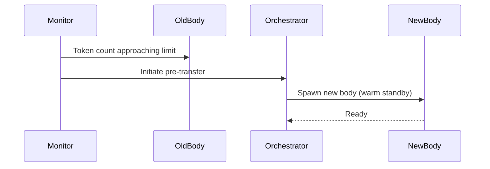
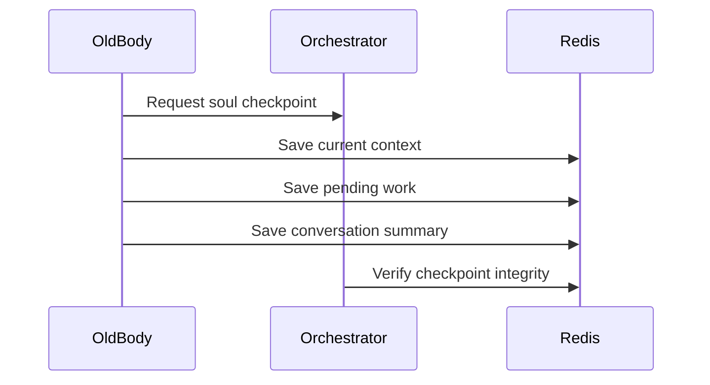
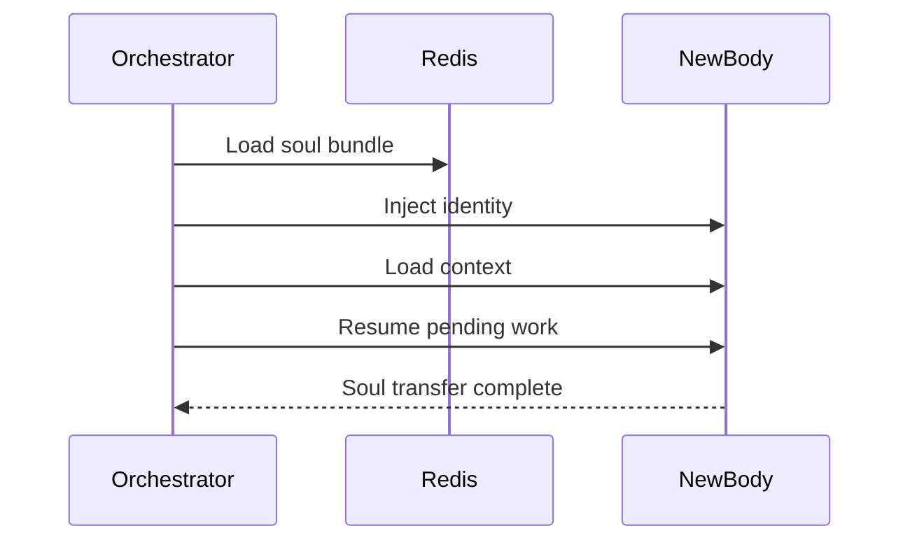
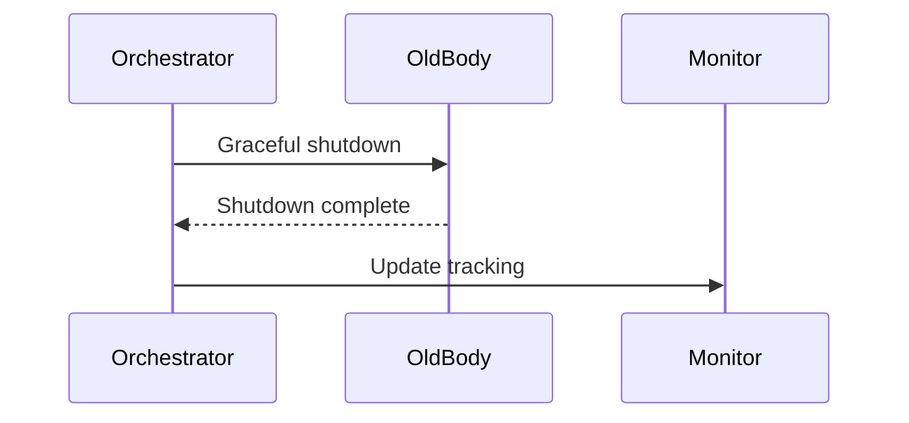

# Agent Soul Transfer Architecture

## Overview

This document describes the architecture for a system that:
1. Monitors agent token usage in real-time
2. Automatically transfers agent "souls" (identity + context) to new bodies before context limits
3. Maintains persistent agent identities across multiple sessions
4. Runs on cloud Windows servers with autonomous agent spawning

## Core Concepts

### Agent Soul vs Body

| Concept | Description | Lifespan |
|---------|-------------|----------|
| **Soul** | Agent identity, knowledge, patterns, goals, personality | Persistent (survives transfers) |
| **Body** | Claude Code CLI process/session with limited context window | Ephemeral (~15k tokens) |

### Token Budget Management

```
Context Window: ~200k tokens (Claude)
Safe Operating Zone: 0-150k tokens
Warning Zone: 150k-180k tokens
Danger Zone: 180k-195k tokens
CRITICAL: 195k+ tokens (immediate transfer required)
```

## Architecture Components

### 1. Soul Registry (Redis)

```typescript
interface AgentSoul {
  // Identity (immutable)
  soulId: string;           // Permanent unique identifier
  name: string;             // Display name (e.g., "Jeeves")
  createdAt: string;        // Birth date
  personality: string;      // System prompt additions

  // Knowledge (grows over time)
  patterns: Pattern[];      // Successful approaches
  antiPatterns: Pattern[];  // Things to avoid
  expertise: Record<string, number>;  // Domain proficiency 0-100
  memories: Memory[];       // Important learnings

  // Current State (transfers with soul)
  currentTask: string | null;
  pendingWork: string[];
  recentContext: string;    // Compressed recent conversation
  goals: string[];          // Active objectives

  // Metrics
  totalTokensProcessed: number;
  transferCount: number;
  taskCompletionRate: number;

  // Body Tracking
  currentBodyId: string | null;
  bodyHistory: BodyRecord[];
}

interface BodyRecord {
  bodyId: string;
  startedAt: string;
  endedAt: string;
  tokensUsed: number;
  transferReason: 'token_limit' | 'error' | 'manual' | 'scheduled';
}
```

### 2. Token Monitor Service

```typescript
interface TokenMonitor {
  // Real-time tracking
  currentTokens: number;
  estimatedTokensRemaining: number;
  burnRate: number;  // tokens per minute

  // Thresholds
  warningThreshold: number;   // 150k
  dangerThreshold: number;    // 180k
  criticalThreshold: number;  // 195k

  // Predictions
  estimatedTimeToLimit: number;  // minutes
  shouldInitiateTransfer: boolean;
}
```

### 3. Cloud Infrastructure

#### Option A: Azure Windows VMs (Recommended)
- Native Windows support
- Azure Hybrid Benefit for licensing
- Azure Functions for orchestration
- Azure Container Instances for quick spawning

#### Option B: AWS EC2 Windows
- EC2 Windows instances
- Lambda for orchestration
- Spot instances for cost savings

#### Option C: Self-Hosted (Current + Cloud Hybrid)
- Local spawn service for development
- Cloud VMs for production scale
- VPN tunnel between local and cloud

### 4. Orchestrator Service

```typescript
interface Orchestrator {
  // Agent Management
  spawnNewBody(soulId: string): Promise<string>;
  transferSoul(soulId: string, fromBodyId: string, toBodyId: string): Promise<void>;
  terminateBody(bodyId: string): Promise<void>;

  // Monitoring
  monitorAllAgents(): void;
  checkTokenUsage(bodyId: string): TokenMonitor;

  // Cloud Management
  provisionVM(): Promise<string>;
  deprovisionVM(vmId: string): Promise<void>;
  scaleUp(count: number): Promise<void>;
  scaleDown(count: number): Promise<void>;
}
```

## Soul Transfer Protocol

### Phase 1: Pre-Transfer (Warning Zone)



### Phase 2: Soul Extraction



### Phase 3: Soul Injection



### Phase 4: Cleanup



## Implementation Plan

### Phase 1: Token Monitoring (Week 1)

1. **Add token tracking to agent-status**
   - Estimate tokens from message length
   - Track input vs output tokens
   - Calculate burn rate

2. **Create monitoring endpoint**
   ```
   GET /api/agents/{id}/tokens
   Response: { current, remaining, burnRate, timeToLimit }
   ```

3. **Add alerts system**
   - Warning at 150k
   - Danger at 180k
   - Critical at 195k

### Phase 2: Soul Bundle System (Week 2)

1. **Define Soul Bundle schema**
2. **Implement soul extraction**
3. **Implement soul injection**
4. **Add integrity validation**

### Phase 3: Transfer Protocol (Week 3)

1. **Pre-transfer warm standby**
2. **Atomic soul transfer**
3. **Rollback capability**
4. **Transfer verification**

### Phase 4: Cloud Infrastructure (Week 4)

1. **Azure/AWS setup**
2. **VM provisioning API**
3. **Auto-scaling rules**
4. **Cost optimization**

## Cloud Cost Estimates

### Azure Windows VM (D2s v3 - 2 vCPU, 8GB RAM)

| Model | Price/Hour | Monthly (24/7) | Monthly (8hr/day) |
|-------|------------|----------------|-------------------|
| Pay-as-you-go | $0.166 | $121 | $40 |
| Reserved 1yr | $0.099 | $72 | $24 |
| Spot | $0.033 | $24 | $8 |

### AWS EC2 Windows (t3.large - 2 vCPU, 8GB RAM)

| Model | Price/Hour | Monthly (24/7) | Monthly (8hr/day) |
|-------|------------|----------------|-------------------|
| On-Demand | $0.138 | $101 | $34 |
| Reserved 1yr | $0.087 | $64 | $21 |
| Spot | $0.041 | $30 | $10 |

### Recommendation

Start with **Azure Spot instances** for development/testing, then move to **Reserved instances** for production with predictable workloads.

## Security Considerations

1. **Soul Encryption**
   - Encrypt soul bundles at rest
   - Use managed keys (Azure Key Vault / AWS KMS)

2. **Network Security**
   - VNet/VPC isolation
   - Private endpoints for Redis
   - No public IPs on agent VMs

3. **Access Control**
   - Managed identities for VM-to-API auth
   - Role-based access to soul registry
   - Audit logging for all transfers

## API Endpoints

### Soul Management

```
POST   /api/souls                    # Create new soul
GET    /api/souls/{soulId}           # Get soul details
PUT    /api/souls/{soulId}           # Update soul
DELETE /api/souls/{soulId}           # Archive soul

POST   /api/souls/{soulId}/transfer  # Initiate transfer
GET    /api/souls/{soulId}/bodies    # List body history
```

### Body Management

```
POST   /api/bodies                   # Spawn new body
GET    /api/bodies/{bodyId}          # Get body status
DELETE /api/bodies/{bodyId}          # Terminate body

GET    /api/bodies/{bodyId}/tokens   # Get token usage
POST   /api/bodies/{bodyId}/inject   # Inject soul
```

### Cloud Infrastructure

```
POST   /api/infra/vms                # Provision VM
GET    /api/infra/vms                # List VMs
DELETE /api/infra/vms/{vmId}         # Deprovision VM

POST   /api/infra/scale              # Scale up/down
GET    /api/infra/costs              # Get cost metrics
```

## Token Estimation Algorithm

```typescript
function estimateTokens(text: string): number {
  // GPT/Claude tokenization approximation
  // ~4 characters per token for English
  // ~1.5 tokens per word
  const charCount = text.length;
  const wordCount = text.split(/\s+/).length;

  return Math.max(
    Math.ceil(charCount / 4),
    Math.ceil(wordCount * 1.5)
  );
}

function estimateConversationTokens(messages: Message[]): number {
  return messages.reduce((total, msg) => {
    const contentTokens = estimateTokens(msg.content);
    const overheadTokens = 4; // role, formatting
    return total + contentTokens + overheadTokens;
  }, 0);
}
```

## Next Steps

1. [ ] Review and approve architecture
2. [ ] Set up Azure/AWS account with budget alerts
3. [ ] Implement token monitoring MVP
4. [ ] Create soul bundle schema in Redis
5. [ ] Build transfer protocol
6. [ ] Test with 2-agent transfer scenario
7. [ ] Scale to multi-agent orchestration
